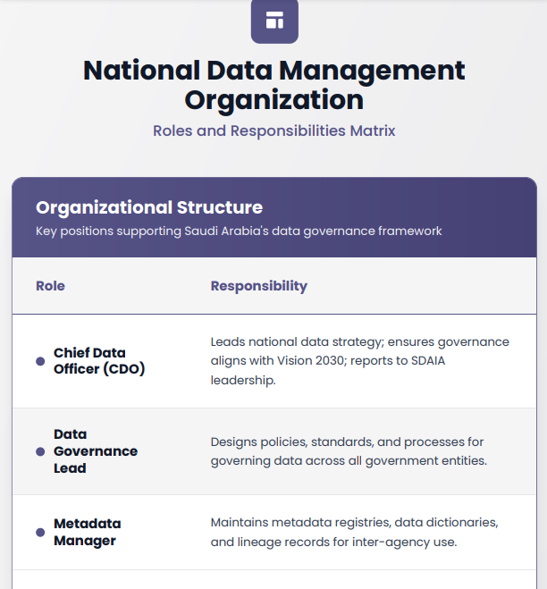
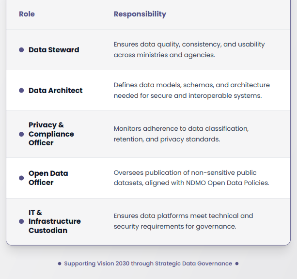

# National Data Management Organization (NDMO)

## Roles & Responsibilities Framework

The National Data Management Organization (NDMO) operates under the Saudi Data and Artificial Intelligence Authority (SDAIA) to establish a comprehensive data governance framework that supports Saudi Arabia's Vision 2030 digital transformation objectives.

This organizational structure ensures coordinated data management across all government entities, promoting data quality, security, and interoperability while enabling evidence-based decision making at the national level.

The following matrix (RACI) outlines the key roles and their corresponding responsibilities within the **NDMO** structure, designed to create a unified approach to data governance that spans ministries, agencies, and public sector organizations throughout the Kingdom.

---

## Organizational Structure

---

### Key Highlights

- **Strategic Alignment**: All roles are designed to support Vision 2030 and national digital transformation goals
- **Cross-Agency Coordination**: Responsibilities span multiple government entities to ensure unified data practices
- **Compliance Focus**: Strong emphasis on privacy, security, and regulatory adherence
- **Open Data Initiative**: Dedicated focus on transparent, accessible public data sharing
- **Technical Excellence**: Robust infrastructure and architectural standards for data systems

This framework establishes clear accountability and ensures that Saudi Arabia's data assets are managed as strategic national resources, supporting informed policy making and enhanced public services delivery.
