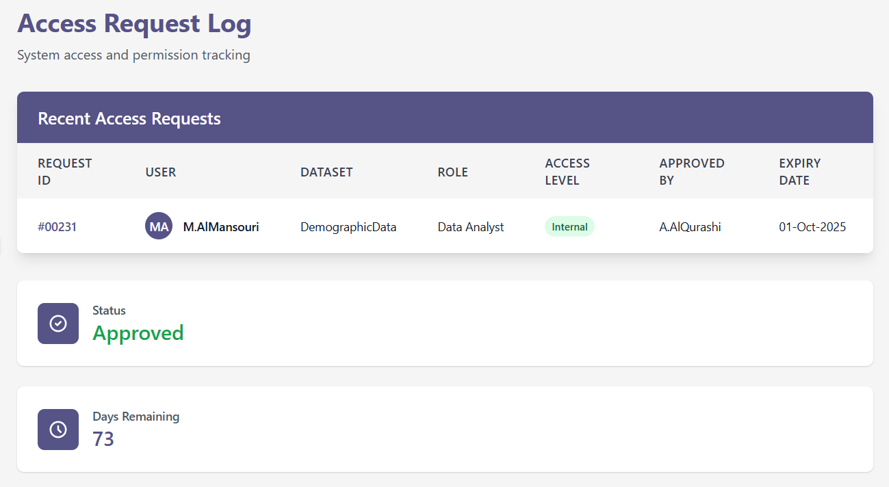

## Who can access what data and under what rules?

# 📄 NDMO Data Access Policy

## 1. Purpose

The purpose of this Data Access Policy is to define the standards, roles, and procedures for accessing data assets managed or governed by the National Data Management Office (NDMO). This ensures that data is protected, used appropriately, and accessed only by authorized personnel for approved purposes.

## 2. Scope

This policy applies to all employees, contractors, consultants, and third-party service providers who require access to NDMO-managed data assets, including structured and unstructured data across all platforms.

## 3. Policy Statement

NDMO is committed to ensuring secure, role-based access to data to maintain confidentiality, integrity, and availability. All data access must comply with applicable laws and the Saudi Data & AI Authority’s (SDAIA) standards.

---

## 4. Roles and Responsibilities

| Role               | Responsibility                                                           |
| ------------------ | ------------------------------------------------------------------------ |
| **Data Owner**     | Approves and monitors access to datasets they are responsible for.       |
| **Data Steward**   | Implements and enforces access controls and ensures data quality.        |
| **Data Custodian** | Administers systems and databases, ensures access policies are applied.  |
| **Data User**      | Accesses data for business or analytical use as per assigned privileges. |

---

## 5. Access Categories

| Category                | Description                                                    |
| ----------------------- | -------------------------------------------------------------- |
| **Public Access**       | Data accessible without restrictions.                          |
| **Internal Access**     | Data accessible only to NDMO employees and authorized parties. |
| **Confidential Access** | Data that requires formal approval before access.              |
| **Sensitive Access**    | Highly sensitive data with limited access to key personnel.    |

---

## 6. Access Control Requirements

- Access to data is granted based on **least privilege** and **need-to-know** principles.
- All access must be approved by the **Data Owner**.
- Users must authenticate via **multi-factor authentication (MFA)**.
- Logging and audit trails must be maintained for all access requests and actions.

---

## 7. Data Access Request Process

1. Submit a formal data access request via the Data Access Request Form.
2. Data Owner reviews and approves/rejects the request.
3. IT team provisions access and notifies the requestor.
4. Access is time-bound and subject to periodic review.

# Sample Access Request Log

---

## 8. Violations and Enforcement

Unauthorized access or misuse of data will lead to:

- Immediate access revocation
- Disciplinary action in accordance with HR policy
- Possible legal action for regulatory non-compliance

---

## 9. Review and Updates

This policy is reviewed annually or upon significant changes in regulations or organizational structure.

---

## 10. References

- SDAIA Data Governance Framework
- NDMO National Data Governance Policies
- Kingdom of Saudi Arabia’s Personal Data Protection Law (PDPL)
- ISO/IEC 27001 and 27701 Standards

[KSA Data Privacy Compliance (PDPL)](https://ahlancyber.com/wp-content/themes/ahlan/pdpl/images/brochure/ksa_data_privacy_compliance.pdf)
