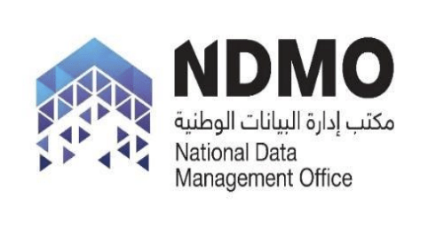

# Mock Data Governance Framework for SDAIA / NDMO

This project presents a simulated data governance framework for the **National Data Management Office (NDMO)**, part of the **Saudi Data and AI Authority (SDAIA)**.

It demonstrates how data governance can be applied in a public sector environment, using best practices from **DAMA-DMBOK** and the **Saudi National Data Governance Framework**.

## 📌 Project Objectives

- Apply theoretical data governance concepts in a real-world-inspired context.
- Showcase understanding of **metadata**, **data roles**, and **policy design**.
- Align the mock governance model with **Saudi Vision 2030** and **NDMO strategy**.
- Serve as a tangible portfolio piece for recruiters and hiring managers.

## 📁 Project Structure

| Component              | Description                                                  |
| ---------------------- | ------------------------------------------------------------ |
| `CompanyProfile.md`    | Background and strategic role of NDMO                        |
| `DataRoles.md`         | Key data roles and responsibilities                          |
| `Policies/`            | Three mock data policies (classification, access, retention) |
| `MetadataCatalog.xlsx` | A sample metadata catalog for a national dataset             |
| `Diagrams/`            | Org chart and data lifecycle visuals                         |

## ✅ Scope of Work

### 1. Company Profile

Overview of NDMO’s mission, data ecosystem, and the governance challenge being addressed.

### 2. Data Governance Roles

Definition of roles such as Chief Data Officer, Metadata Manager, Data Steward, and more — all aligned with DAMA-DMBOK and tailored to Saudi public sector structure.

### 3. Governance Policies

Three realistic policy documents:

- **Data Classification Policy**
- **Access Control Policy**
- **Data Retention Policy**

### 4. Metadata Sample

A mock metadata catalog for a government-wide dataset, including fields, data types, descriptions, classification levels, and ownership.

### 5. Diagrams

Visuals illustrating:

- The Data Lifecycle in NDMO
- The organizational structure of governance roles

## 🧰 Tools & Technologies

- **Markdown (.md)** — Policy and documentation
- **Excel (.xlsx)** — Metadata catalog
- **Draw.io / Lucidchart** — Diagrams
- **GitHub** — Project hosting and version control

## 🎯 Learning Outcomes

By completing this project, I deepened my understanding of:

- The real-world application of data governance frameworks
- The role of metadata and classification in national-level data policy
- Public sector data leadership in the Kingdom of Saudi Arabia
- Alignment with Vision 2030's digital transformation and data economy goals

---

## 🇸🇦 Vision Alignment

This project is aligned with:

- **SDAIA’s goal** to build a data-driven government
- **NDMO’s regulations** to standardize data handling across ministries
- **Vision 2030’s objective** to unleash the power of data as a national asset
